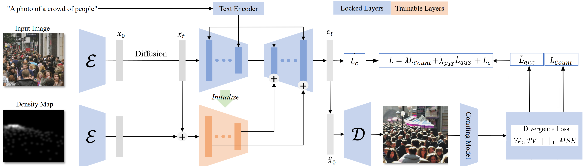

### Crowd-augmentation Control Net

This code is a modification of the control net proposed by [[2]](#2) to generate artificial training images for object counting problems. Using the ControlNet architecture [[3]](#3), we train a model that given a control input $Y\in[0,1]^{512\times512}$ which is a Gaussian density map, learns to generate an image $X(Y)\in[-1,1]^{512\times512}$ of crowds such that each Gaussian cloud in $Y$ corresponds to the position of a person's head. 
A prompt can be passed as additional input such as "a group of people walking down the street.". The motivation comes from the fact that
each annotation is a probability density function. This gives us the possibility to evaluate the model's performance using the Gaussian cloud's distributional properties, rather than low-level pixel informations.



Each loss has the form $L_c + \lambda L_{count} + \lambda_{aux}L_{aux}$, where $L_{c}$ is the standard diffusion model loss, $L_{count}$ and $L_{aux}$ are the control loss.
During training, noise is added to each training image and the model learns to undo this procedure. This is evaluated by $L_{count}$. 
In order to learn to generate accurate crowds wrt. the control input $Y$, the control loss is used. Given the predicted noise, we (approximately) reconstruct the initial image 
and pass it through a counting model which produces a new Gaussian density map $\hat{Y}$. The control loss compares $Y$ and $\hat{Y}$, ranging from pixel-wise to positional comparison of heads between $Y$ and $\hat{Y}$.
We implemented the following choices for $\L_{count}$ and $L_{aux}$.
* The MSE loss as in [[2]], 
    $$
        L_{MSE}\left(Y,\hat{Y}\right) = ||Y-\hat{Y}||_2^2
    $$
* The Total Variation loss,
    $$
        L_{TV}\left(Y,\hat{Y} \right) = ||Y-\hat{Y}||_1
    $$
* The counting loss,
    $$
        L_{counting} = |\,||Y||_1 - ||\hat{Y}||_1\,| 
    $$
* An average Wasserstein 2 loss between Gaussian clouds from each density map,
    $$
        L_{\mathcal{W}_2} =\frac{1}{C}\sum_{k=1}^C\mathcal{W}_2\big( Y_k,\hat{Y}_k \big) + s\mathcal{P}(Y,\hat{Y})\,,\quad C=\min(||Y||_1,||\hat{Y}||_1)
    $$
where $Y_k$ and $\hat{Y}_k$ denote the $k$-th Gaussian cloud (assumed these are ordered), $\mathcal{P}$ is a penalizing term that becomes effective when $||Y||_1\neq ||\hat{Y}||_1$ and $s$ is a scaler to increase or decrease the importance of $\mathcal{P}$.
The combinations of $L_{count}$ and $L_{aux}$ we propose are   
    1. $L_{count}=L_{MSE}$ and $L_{aux}= L_{TV}$
    2. $L_{count}=L_{\mathcal{W}_2}$ and $L_{aux}= L_{TV}$
    3. $L_{count}=L_{\mathcal{W}_2}$ and $L_{aux}=L_{counting}$
    4. $L_{count}=L_{counting}$ and $L_{aux}=L_{TV}$

We trained 13k steps for 1 and 2. The dictionnaries are available at [INCLUDE LINK].
Further implementation details can be found at [INCLUDE LINK].

The initial code is from [[3]], found at https://github.com/lllyasviel/ControlNet. We list the modifications in 'modification.txt'.

# Overview:
* Installation of the control net [here](installation-and-setting-up-the-controlNet)
* Warnings and errors that occured to me when re-doing the installation [here](additional-warnings-errors-that-might-occur)
* Loading the training and test data [here](loading-data)
* Usage includes training, testing and other files  [here](usage)


## Installation and setting up the ControlNet: 
Clone the Git rep `git clone --depth 1` and follow the following instructions :
1) create a conda venv `conda create -n xcontrol python=3.9`. I used conda 24.4.0. Then activate the env. This followed the steps from https://github.com/lllyasviel/ControlNet/issues/612. 

    First install this package 
    `pip3 install -U xformers torchvision --index-url https://download.pytorch.org/whl/cu118`

    Then install the rest of the packages from the .yaml file `conda env update --name xcontrol --file environment_X.yaml`. The yaml file should be located in the ControlNetHome folder.

2) Follow the first steps of Step 3 from https://github.com/lllyasviel/ControlNet/blob/main/docs/train.md :

    a) download the file "v1-5-pruned.ckpt" from https://huggingface.co/runwayml/stable-diffusion-v1-5/tree/main (DEAD LINK --> located in folder /net/vid-raxus/storage/deeplearning/users/luk02485/control_net_checkpoints ). This file **needs** to be located in  "./ControlNetHome/models/v1-5-pruned.ckpt". 

    b) Navigate inside "./ControlNetHome" and execute
    
     ```
     python tool_add_control.py ./models/v1-5-pruned.ckpt ./models/control_sd15_ini_v2.ckpt
     ```

     The newly created file "./ControlNetHome/models/control_sd15_ini.ckpt" should appear.

3) Installing STEERER : The code for STEERER has been written with an obsolete version of mmcv. We now require mmengine aswell and had to modify imports inside the code. Do 
```
pip3 install mmcv==2.2.0 -f https://download.openmmlab.com/mmcv/dist/cu118/torch2.3/index.html
```

4) Strictly follow the installation instructions from https://github.com/open-mmlab/mmengine to install mmengine :

    ```
    pip install -U openmim
    mim install mmengine
    ```

5) Make sure the following line is correctly written in the file "./Steerer./lib.models/heads.base_head.py" at line 5 :
`from mmengine.mmengine.model import base_module.py`

6) Finish installing the other packages 
```
pip3 install dict_recursive_update
pip3 install yacs
```

7) For STEERER to work, you need to download the weights _"Ep_617_mae_32.5_mse_80.4"_ or _"JHU_mae_54.5_mse_40.6"_ from the git https://github.com/taohan10200/STEERER/tree/main. Our latest model uses the dictionnary of STEERER trained on the NWPU set, which is the former file. Rename the file as "nwpu_pre_trained.pth"

### Additional warnings/errors that might occur:
 If upon  initializing the model
 
 (include graphic here), 
 
1) the warning :
_"Some weights of the model checkpoint at openai/clip-vit-large-patch14 were not used when initializing CLIPTextModel:..."_
arises then run 
```
pip install --upgrade transformers
```

2) the warning _"UserWarning: Plan failed with a cudnnException: CUDNN_BACKEND_EXECUTION_PLAN_DESCRIPTOR: cudnnFinalize Descriptor Failed "_
follow the steps :
    1) Create backup of current env `conda env export > NAME.yaml` (e.g. _control2.yaml_)
    2) re-install pytorch with the correct cuda version. For this build :
        `conda install pytorch torchvision torchaudio pytorch-cuda=11.8 -c pytorch -c nvidia`
    3) Then install the backup env again `conda env update -f NAME.yaml`.

    Everything should run without warning/error now.

3) Error "ASGD is already registered in optimizer at torch.optim.asgd" :
    According to https://github.com/open-mmlab/mmengine/issues/1593 this is due to a pytorch>=2.5 update and requires to change code at 
    /home/user/.conda/envs/control_test/lib/python3.9/site-packages/mmengine/optim/optimizer/builder.py 
    See : https://github.com/open-mmlab/mmengine/commit/4c22f78cdea2981a2b48a167e9feffe4721f8901 

## Changes done to the original ControlNet Code

(Old) The following changes have been done to create and load the model on GPU directly rather than CPU. This allows for single GPU training
* Process kept getting killed because ran out of RAM. 
    * Followed git issue : https://github.com/andreemic/ControlNet/commit/d04147f037b3da6d50d594876c0bfffecbe9ed13#diff-e349da9602c94a21a14bd5bee4f90d52c843e66a0c94ecf723ac06d77652e257
        - cldm.model.py         at line 12 : changed default value 'location='cuda'.'
                                at  line 26 : replaced with 'model = instantiate_from_config(config.model).cuda()'
        - tool_add_control.py   at line 48 : removed 'location' variable -> runs with default 'cuda' 

(latest) To allow for multiple cpu training, we revert back to the way the models were initialized in the original code :
```python
model=create_model('./ControlNetHome/models/cldm_v15.yaml'
        ,location=None).cpu()

interm = load_state_dict(resume_path
        , STEERER_path=STEERER_path
        ,location=None)

model.load_state_dict(interm,strict = False)
```
where the functions "create_model()", "load_state_dict()" are the same as in the ControlNet git with the sception that the STEERER dict are also loaded.

### Xformers package :
An issue with trying the multi-GPU training is to initialize all models on the CPU and make sure no process is started i.e. no torch.cuda is called prior to launching `pl.fit()`. To solve this :
*  Restrict `CUDA_VISIBLE_DEVICES` to all unused GPU and exclude `Device:0` completely as the background processes are running constantly which results in at least one to be present when calling `torch.cuda.list_active_processes()`.
* Comment out the xformers import and set `XFORMERS_IS_AVAILBLE = False` in the files _ControlNetHome/ldm/modules/attention.py_ and _ControlNetHome/ldm/modules/diffusionmodules/model.py_. This package is being used to import the object `memory_efficient_attention()` from xformer.ops but is not used in the Class ojects that are being imported from the above mentioned files. It is during the import of xformers.ops that `torch.cuda.is_initialized() = True`.

## Overview of the model loading
```bash

  | Name              | Type               | Params
---------------------------------------------------------
0 | model             | DiffusionWrapper   | 859 M
1 | first_stage_model | AutoencoderKL      | 83.7 M
2 | cond_stage_model  | FrozenCLIPEmbedder | 123 M
3 | control_model     | ControlNet         | 361 M
4 | counter           | CounterWrapper     | 64.6 M
---------------------------------------------------------
1.2 B     Trainable params
271 M     Non-trainable params
1.5 B     Total params
5,968.636 Total estimated model params size (MB)
```

This is first loaded on the CPU. 

## Loading Data
Before training the model, you will need to process your data. We used the NWPU set [[1]](#1) but any dataset will work if it is organised as such:

```markdown
- **nwpu/**
    -**images/**
    -**mats/**
    -**jsons/**
```

where ```ìmages``` provides the ```*.jpeg``` images, and two types of labels(```jsons``` and ```mats```). The points order is ```x, y```. To be specific, the contents of ```.mat``` files are consistent with the UCF-QNRF. The boxes labels is ```xmin, ymin, xmax, ymax```. Only one folder ```mats``` or ```jsons``` is required. Run, the following :

```bash
 python -m data_tools.load_dataset.py RAW_DATA_LOC DATA_LOC DEVICE MINIMAL_DENSITY MAXIMAL_DENSITY
``` 

where ```RAW_DATA_LOC``` is the location of the dataset, ```DATA_LOC``` is where you want to store the processed dataset. Both arguments are required. Optionally, you can set the ```DEVICE``` and the ```MINIMAL_DENSITY``` and ```MAXIMAL_DENSITY``` of objects contained on each pair image-density_map. Running this command will slice as much 512,512 images of the dataset and construct the associated gaussian density maps, along with the EM-Gaussian mixture model approximated means of the annotated gaussian clouds on the density maps. Running this file is long depending on the size of your dataset. You will be left will a directory

```markdown
- **DATA_LOC/**
    -**train/**
        -**img/**
        -**map/**
        -**mean/**
```

## Usage :
After installing all dependencies, activate the conda environment `conda activate xcontrol`. 
We included a example script, that loads the control net and generates an image given a density map. To run this, first open the file "test.py" and change the settings 
```python
resume_path = './weights.ckpt'    # weights_path
gpu = torch.device(0)                       # device
path_to_img = './image_path.png'
path_to_map = './map_path.png'
prompt = ['a group of people sitting on chairs in a room']  #text prompt or [''] for promptless sampling
 
control_eval = 'MSE'    # specify the control loss for 'count_guidance_ddpm' ("MSE"/ "W2-count" / "w2-TV" / "count TV")
path_to_means = './centroids_path.png'      # required for count_guidance_ddpm
steps = 100     #number of ddim and ddim_guided steps

```
Then run :
```bash
python test.py method nb
```
where method is the sampling method: 'ddim', 'count_guidance_ddpm', 'ddim_guidance'. 'count_guidance_ddpm' and 'ddim_guided' require a GPU with at least 20GB (due to gradient computation) while 'ddim' only requires 10GB. 'nb' is the number of samples to generate.

We trained on a Nvidia L40 with 48GB with a batch-size of 2. The GPU was almost full capacity (~46GB). We recommend using a batch-size of 1 and increase 'accumulate_grad_batches'. To train run:
```bash
python train.py
```
There are a lot of parameters that you can tweak before training. Open the file and manually set them :
```python 
os.environ['CUDA_VISIBLE_DEVICES'] = '0,1,2,3' # available GPUs
AVAILABLE_GPU = [2]                            # Choose one GPU
resume_path = 'epoch=0-step=50-v2.ckpt'#       # weight_dict or './ControlNetHome/models/control_sd15_ini_v2.ckpt' for untrained dict
batch_size = 2                                 # Achieved maximum of 2
num_workers = 15                               # DataLoader workers

#training strategy :
accumulate_grad_batches = 32                   # should be set higher for smaller batch-size
max_val_per_epoch = 64
check_val_every_n_epoch = 4
accumulation_steps = 10000                     # Standard steps for all our models. We think at least double this amount is necessary.
```

Before running, you can enter which control loss you wish to train with. For this open the file ./ControlNetHome/models/cldm_v15_2.yaml and under "control_eval", you can set one of these: "w2-tv" #"mse"/ "w2-count" / "w2-tv" / "count-tv"

You can check the performance of the divergence losses on your dataset by running the following test :
Go to `/project_root_dir/ControlNetHome/` and run 


```bash
python -m tools.divergence_loss path_to_train device scale_bool
```

where path_to_train is the path to the train/ folder containing map/,mean/,img/, device is the device to run this on (recommended to choose a GPU), scale: 1 or 0 if you wish to scale the W2-loss down to training values. The test return the maximum memory peak, time needed and largest error with a 0 density map, during a batch 2 forward and backward pass.

If you wish to train a version of STEERER with your already processed data, you can run this script which will copy the data and process it to the STEERER training format 

```bash
python -m data_tools.steerer_format_dataset.py arg1 arg2
```

where arg1 is the location of "DATA_LOC/" and arg2 the save location you want the data to be.

All loss functions are dependant on your counting model and we wrote a script to test how accurate the counting model is w.r.t. TV/MSE/W2 losses. Run from the project_root_dir :

```bash
python -m STEERER.test_counter arg1 arg2 arg3
```

where arg1 is the location of your processed dataset, arg2 is a temporary location to store intermediate density maps, arg3 is the gpu to use.


## References
<a id="1">[1]</a> 
Junyu-Xuelong, (2020). 
NWPU-Crowd: A Large-Scale Benchmark for Crowd Counting and Localization.
IEEE Transactions on Pattern Analysis and Machine Intelligence

<a id="2">[2]</a> 
Wang, Zhen, et al. (2024).
Diffusion-based Data Augmentation for Object Counting Problems. 
arXiv preprint arXiv:2401.13992 

<a id="3">[3]</a> 
Lvmin Zhang and Anyi Rao and Maneesh Agrawala (2023).
Adding Conditional Control to Text-to-Image Diffusion Models.
IEEE International Conference on Computer Vision (ICCV)
